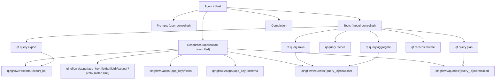

# Qingflow MCP vNext Agent-Native Design

本设计稿用于定义 `qingflow-mcp` 从 `0.3.15` 的“严格版 API wrapper”演进为“agent-native 查询协议层”的下一阶段方案。`0.4.0` 已落地第一阶段实现：canonical tools、resources、prompts、query/export artifacts。

目标不是继续堆更多工具，而是把对外协议收敛成：

1. 更少的 canonical tools
2. 更强的 resources / resource links / completion
3. 一套稳定、统一、与轻流原生 API 解耦的 query DSL
4. 明确的迁移路径，保证 `0.3.x` 用户可平滑升级

## 1. Design Inputs

本方案基于以下 MCP 官方设计方向：

- MCP 以 `tools`、`resources`、`prompts`、`tasks` 为基础 primitive，强调 `Composability over specificity` 与 `Convergence over choice`  
  Source: [Design Principles](https://modelcontextprotocol.io/community/design-principles)
- `tools` 是 model-controlled，用于执行动作；`resources` 更适合参考数据、配置、查询快照等无副作用内容  
  Source: [Tools](https://modelcontextprotocol.io/specification/2025-03-26/server/tools), [MCP TypeScript SDK](https://ts.sdk.modelcontextprotocol.io/documents/server.html)
- `resource_link` 适合在 tool 结果中引用大结果，而不是把大 JSON 全量塞进上下文  
  Source: [MCP TypeScript SDK](https://ts.sdk.modelcontextprotocol.io/documents/server.html), [2025-06-18 changelog](https://modelcontextprotocol.io/specification/2025-06-18/changelog)
- `completion` 作用于 prompt 参数和 resource template 参数，适合字段值候选与参数补全  
  Source: [Completion](https://modelcontextprotocol.io/specification/2025-11-25/server/utilities/completion)
- `tasks` 适合长任务异步化，但仍属 experimental；短中型查询更适合先用 `progress` + 句柄续取  
  Source: [Tasks](https://modelcontextprotocol.io/specification/2025-11-25/basic/utilities/tasks)
- 工具命名应尽量稳定、可分层、便于迁移  
  Source: [SEP-986 Tool Names](https://modelcontextprotocol.io/community/seps/986-specify-format-for-tool-names)

## 2. Current Gaps in 0.3.15

`0.3.15` 已经修复了两个关键基础问题：

1. `listTools()` 返回真实 `inputSchema`
2. 正式工具的 public schema 已改为严格 JSON 契约

但从 agent-native 角度，仍存在以下结构性问题：

1. 工具面过宽且重叠
   - `qf_records_list` vs `qf_query(list)`
   - `qf_record_get` vs `qf_query(record)`
   - `qf_records_aggregate` vs `qf_query(summary)`
2. 对外参数形态仍带有明显轻流原生 API 心智
   - `search_key`
   - `search_keys`
   - `min_value`
   - `max_value`
   - `time_range`
3. 缺少面向 agent 的值探测能力
4. 大结果主要仍靠工具直接返回，而非资源句柄
5. `query_id` 还不是统一的查询 artifact / handle

一句话：`0.3.15` 解决了“能不能稳”，但还没完全解决“能不能自然”。

## 3. vNext Architecture

### 3.1 Target Primitive Split

`vNext` 不再只靠 tools。建议对外分成四层：

1. `Tools`
   - 执行查询、聚合、写入、导出
2. `Resources`
   - schema、字段字典、字段值候选、查询快照、导出结果
3. `Prompts`
   - 用户主动触发的工作流模板
4. `Completion`
   - prompt 参数与 resource template 参数补全

长查询与大导出，在后续补 `Tasks`。

### 3.2 Canonical Structure



### 3.3 Canonical Tool Surface

建议对 agent 主推荐的 public tools 收缩为以下 6 个。

#### `qf.query.plan`

职责：

- 预检 query DSL
- 字段解析
- 值匹配预览
- 扫描预算评估
- 判断能否直接下最终结论

说明：

- 这是唯一允许“宽松输入 -> 规范化结果”的入口
- 正式执行工具不再承担隐式纠偏职责

#### `qf.query.rows`

职责：

- 按统一 DSL 查询多条记录
- 返回扁平行
- 返回 `query_id`
- 大结果返回 `resource_link`

#### `qf.query.record`

职责：

- 按 `apply_id` 或 `query_id + cursor` 获取单条详情
- 强制 `select`
- 保持扁平输出

#### `qf.query.aggregate`

职责：

- 统一统计、分组、时间桶、TopN、占比
- 返回显式 `metrics_by_column`
- 不再输出歧义 `total_amount`

#### `qf.records.mutate`

职责：

- create / update 合并成单一写入口
- 通过 `action=create|update`
- 异步结果仍可关联 operation / task

#### `qf.query.export`

职责：

- 执行大结果导出
- 默认返回 `resource_link`
- 大任务场景后续可升级为 task-based

### 3.4 Resources

这些内容更适合通过 `resources` 暴露，而不是每次都走工具。

#### `qingflow://apps/{app_key}/schema`

用途：

- 应用级 schema 摘要
- 推荐用于客户端缓存和调试

#### `qingflow://apps/{app_key}/fields`

用途：

- 字段字典
- 包含 `que_id`、`title`、`type`、候选值能力标签

#### `qingflow://apps/{app_key}/fields/{field}/values{?prefix,match,limit}`

用途：

- 字段值探测
- 精确匹配预览
- 模糊候选值
- 高频值采样

这类值探测应优先走 resource template，而不是通用 query tool。

#### `qingflow://queries/{query_id}/normalized`

用途：

- 查询归一化快照
- 用于审计、复盘、重放

#### `qingflow://queries/{query_id}/snapshot`

用途：

- 本次查询的小结果快照
- 大结果时返回指向快照的 `resource_link`

#### `qingflow://exports/{export_id}`

用途：

- 导出文件 metadata
- 文件路径 / MIME / 预览 / 生成时间 / query_id

### 3.5 Prompts

Prompts 不是核心执行层，而是用户主动触发的工作流模板。

建议只保留少量高价值模板：

1. `analyze-period-comparison`
   - 对比两个时间区间的数据
2. `build-query-from-question`
   - 把自然语言需求转成 query DSL
3. `prepare-record-write`
   - 辅助生成写入 payload

说明：

- Prompt 是 user-controlled，不应替代 tool 调用协议
- Prompt 应服务于“可发现工作流”，不应承载业务核心逻辑

### 3.6 Completion

Completion 重点用在两个地方：

1. Prompt 参数补全
   - `app_key`
   - `field`
   - `metric`
2. Resource template 参数补全
   - `field` 候选
   - `value prefix` 候选
   - `match mode`

这会比继续扩展 tool 参数更符合 MCP 原生设计。

### 3.7 Tasks and Progress

任务分层建议：

1. `progress` 先落地
   - 大查询扫描进度
   - 导出进度
   - 聚合进度
2. `tasks` 后落地
   - 仅用于长时间导出 / fetch_all / 大聚合

原因：

- `tasks` 在 `2025-11-25` 版本仍属 experimental
- 当前阶段先用 `query_id + resource_link + progress` 更稳

## 4. Canonical Query DSL

### 4.1 Goals

这套 DSL 的目标是：

1. 让 agent 不再直接学习轻流 OpenAPI 细节
2. 对外统一过滤语义、匹配语义、聚合语义
3. 对内再翻译成轻流原生参数

### 4.2 Canonical Query Envelope

统一查询入参建议形态：

```json
{
  "app_key": "21b3d559",
  "select": ["客户名称", "报价总金额"],
  "where": [
    {
      "field": "报价日期",
      "op": "between",
      "from": "2026-01-01",
      "to": "2026-03-31"
    },
    {
      "field": "报价类型",
      "op": "in",
      "values": ["新购", "续费"],
      "match": "exact"
    }
  ],
  "sort": [
    {
      "field": "报价日期",
      "direction": "desc"
    }
  ],
  "limit": 50,
  "cursor": null,
  "strict_full": false
}
```

### 4.3 Field Reference

DSL 中 `field` 支持两种写法：

1. 精确字段标题
2. `que_id`

但工具输出中始终归一化为：

```json
{
  "field_ref": {
    "que_id": 6299264,
    "title": "报价日期",
    "type": "date"
  }
}
```

### 4.4 Filter Grammar

统一支持以下操作符：

- `eq`
- `neq`
- `in`
- `not_in`
- `contains`
- `prefix`
- `between`
- `gte`
- `lte`
- `exists`
- `not_exists`

说明：

- `between` 统一承载日期范围与数值范围
- `exists/not_exists` 对应“已填写/未填写”
- 不再对外暴露 `search_key/search_keys/min_value/max_value/scope`

### 4.5 Match Semantics

字符串匹配语义必须显式：

- `exact`
- `normalized`
- `contains`
- `prefix`
- `fuzzy`

输出中必须回显：

```json
{
  "match_result": {
    "requested": "北斗",
    "mode": "exact",
    "matched_values": ["北斗"],
    "ambiguous": false
  }
}
```

这部分是 vNext 中“值探测”和“可证明匹配”的关键。

### 4.6 Aggregate DSL

聚合统一从 rows DSL 扩展：

```json
{
  "app_key": "21b3d559",
  "where": [
    {
      "field": "报价日期",
      "op": "between",
      "from": "2025-01-01",
      "to": "2025-03-31"
    }
  ],
  "group_by": ["报价类型"],
  "metrics": [
    { "column": "报价总金额", "op": "sum" },
    { "column": "报价总金额", "op": "avg" },
    { "op": "count" }
  ],
  "time_bucket": "month",
  "top_n": 20,
  "strict_full": true
}
```

### 4.7 Aggregate Output Contract

多金额列时，不再输出歧义 `total_amount`。统一改为：

```json
{
  "summary": {
    "record_count": 649,
    "metrics_by_column": {
      "报价总金额": {
        "sum": 1234567.89,
        "avg": 1902.26
      },
      "回款金额": {
        "sum": 987654.32
      }
    }
  },
  "groups": [
    {
      "group_key": {
        "报价类型": "新购"
      },
      "record_count": 212,
      "metrics_by_column": {
        "报价总金额": {
          "sum": 456789.01
        }
      }
    }
  ]
}
```

如果确实存在业务主金额列，再显式提供：

```json
{
  "primary_metric_column": "报价总金额"
}
```

### 4.8 Query Artifact

每次执行工具后，都应产出稳定 `query_id`：

```json
{
  "query_id": "qf_q_01JQ...",
  "normalized_query": {
    "app_key": "21b3d559",
    "select": ["客户名称", "报价总金额"],
    "where": [...]
  }
}
```

`query_id` 用于：

1. 续扫
2. 导出
3. 查询快照
4. 审计
5. 聚合复用

这会把“参数搬运”变成“句柄传递”。

## 5. Recommended Public Contract

### 5.1 Small Result

小结果优先返回：

```json
{
  "ok": true,
  "data": {
    "query_id": "qf_q_01JQ...",
    "rows": [
      {
        "apply_id": "497600278750478338",
        "客户名称": "上海流数科技有限公司",
        "报价总金额": 21960
      }
    ],
    "cursor": null,
    "completeness": {
      "is_complete": true,
      "raw_scan_complete": true,
      "output_page_complete": true
    }
  }
}
```

### 5.2 Large Result

大结果不应直接塞进 tool 文本结果，而应返回：

```json
{
  "ok": true,
  "data": {
    "query_id": "qf_q_01JQ...",
    "row_count": 10000,
    "resource_link": {
      "uri": "qingflow://queries/qf_q_01JQ.../snapshot",
      "name": "Query Snapshot",
      "mimeType": "application/json"
    }
  }
}
```

### 5.3 Values Probe Result

值探测输出建议：

```json
{
  "ok": true,
  "data": {
    "field_ref": {
      "que_id": 9500572,
      "title": "报价类型"
    },
    "match_mode": "exact",
    "candidates": [
      {
        "value": "新购",
        "count": 212,
        "match_strength": 1
      },
      {
        "value": "续费",
        "count": 188,
        "match_strength": 1
      }
    ]
  }
}
```

## 6. Migration Strategy from 0.3.15

### 6.1 Migration Principles

迁移必须遵守：

1. 不做 flag day
2. 旧工具继续可用一个完整大版本周期
3. 新协议先并存，再默认，再淘汰

### 6.2 Mapping Table

| 0.3.15 | vNext canonical |
|---|---|
| `qf_query_plan` | `qf.query.plan` |
| `qf_records_list` | `qf.query.rows` |
| `qf_query(list)` | `qf.query.rows` |
| `qf_record_get` | `qf.query.record` |
| `qf_query(record)` | `qf.query.record` |
| `qf_records_aggregate` | `qf.query.aggregate` |
| `qf_query(summary)` | `qf.query.aggregate` |
| `qf_record_create` / `qf_record_update` | `qf.records.mutate` |
| `qf_export_csv` / `qf_export_json` | `qf.query.export` |
| `qf_field_resolve` | `fields resource + completion + qf.query.plan` |

### 6.3 Release Phases

#### Phase 1: `0.4.x`

目标：

- 新增 canonical tools，但保留全部旧工具
- 新增 resources / resource templates
- `README` 和 tool spec 开始主推 canonical tools

策略：

- 旧工具继续正常返回
- tool spec 中增加 `preferred_replacement`
- canonical tools 默认使用新 DSL

#### Phase 2: `0.5.x`

目标：

- 旧工具进入 deprecation
- docs 和 examples 全量切换到 canonical tools
- 客户端主要接入 `query_id + resource_link`

策略：

- 旧工具结果中增加 `deprecation_warning`
- 旧工具不再新增能力，只做兼容维护

#### Phase 3: `0.6.x`

目标：

- 旧工具变为 compatibility layer
- 新能力仅在 canonical layer 提供

策略：

- 若生态迁移顺利，可考虑把旧工具从默认展示中隐藏
- 保留 alias，但不作为主文档接口

### 6.4 Implementation Order

按工程收益排序，建议这样推进：

#### P2.1 Query Artifact

- 给现有 `query_id` 升级为正式 handle
- 增加 `qingflow://queries/{query_id}/normalized`
- 增加 `qingflow://queries/{query_id}/snapshot`

#### P2.2 Resources + Resource Links

- 给大结果改用 `resource_link`
- 增加 schema / fields / values resources

#### P2.3 Canonical Rows Tool

- 新增 `qf.query.rows`
- 用 DSL 取代原生轻流参数暴露

#### P2.4 Values Probe

- 新增字段值探测 resource template
- completion 接入字段值候选
- 需要兼容时再补一个 tool 版 `qf.query.values`

#### P2.5 Canonical Aggregate

- 新增 `metrics_by_column`
- 明确 `primary_metric_column`
- 显式 `match_mode`

#### P2.6 Prompts / Progress / Tasks

- 先加 prompts
- 再加 `progress`
- 最后仅在长任务场景引入 `tasks`

### 6.5 Compatibility Rules

迁移期内建议遵守以下兼容策略：

1. 旧工具的输入 contract 不再继续放宽
2. 旧工具继续输出结构化错误，但错误提示中给出 canonical tool 示例
3. 旧工具返回中可增加：

```json
{
  "deprecation": {
    "status": "supported",
    "preferred_tool": "qf.query.rows",
    "sunset_version": "0.6.0"
  }
}
```

4. `qf_tool_spec_get` 需同步暴露：
   - `canonical = true|false`
   - `preferred_replacement`
   - `migration_notes`

## 7. What Should Not Be Done

`vNext` 不建议做以下事情：

1. 不要继续增加更多 wrapper-style 查询工具
2. 不要继续把轻流原生查询参数直接暴露给 agent
3. 不要把“字段值探测”继续藏在隐式模糊匹配里
4. 不要对多金额列继续输出歧义 `total_amount`
5. 不要把大结果继续直接回填到模型上下文中

## 8. Final Recommendation

如果只做一件事，最值得做的是：

**先落地 `query_id + resources + canonical rows/aggregate DSL` 这条主链路。**

原因：

1. 它能同时解决工具重叠问题
2. 它能把大结果从上下文里移出去
3. 它能把“参数搬运”变成“句柄传递”
4. 它为值探测、completion、tasks 留出自然扩展位

一句话总结：

`vNext` 不该只是“更严格的 qingflow wrapper”，而应成为“以 query handle 和 resources 为中心的 agent-native 查询协议层”。
